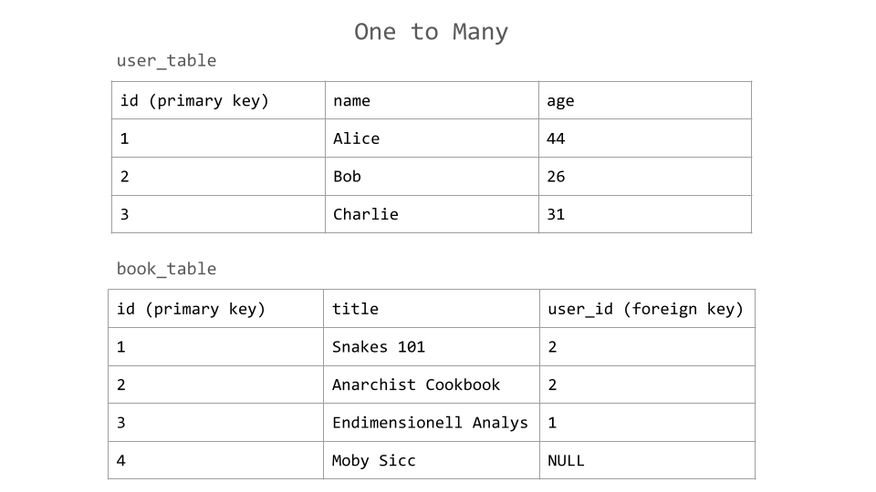

# Database relationships

So far we have only learned to store isolated objects. However, our data will need relationships between these objects. There are a few types of relationships: One-to-One, Many-to-Many and One-to-Many which we will start with.

Let's model a library with one User table and one Book table. We want <em>One</em> user to have <em>Many</em> books. Database relations are created by storing `id`'s from one table in another table. When Primary Keys (unique `id`'s) from table A are stored in table B they are called Foreign Keys, since these `id`'s are foreign to Table B.

Our Book table will have a column for storing the `id`'s of one User. This means several books may have the same user `id`, but every Book can only have one user `id`.



If this is the state of our library, then Moby Sicc is not taken by anyone and Charlie is not borrowing any book.

The following code is an implementation of the strucutre above:

```py
from typing import Optional
from sqlalchemy import ForeignKey
from sqlalchemy.orm import (
    DeclarativeBase,
    MappedAsDataclass,
    Mapped,
    mapped_column,
    relationship,
)


class BaseModelDB(DeclarativeBase, MappedAsDataclass):
    pass


class UserInDB(BaseModelDB):
    __tablename__ = "user_table"

    id: Mapped[int] = mapped_column(primary_key=True, init=False)

    name: Mapped[str] = mapped_column()

    books: Mapped[list["BookInDB"]] = relationship(back_populates="user", init=False)


class BookInDB(BaseModelDB):
    __tablename__ = "book_table"

    id: Mapped[int] = mapped_column(primary_key=True, init=False)

    title: Mapped[str] = mapped_column()

    user_id: Mapped[Optional[int]] = mapped_column(
        ForeignKey("user_table.id"), init=False
    )

    user: Mapped[Optional["UserInDB"]] = relationship(
        back_populates="books", init=False
    )


```

Let's go through it:

```py
user_id: Mapped[Optional[int]] = mapped_column(ForeignKey("user_table.id"), init=False)
```

This defines a column which contains either Foreign Keys pointing to the `id` field of `user_table`, or just the value NULL. A book must not always be taken in a library.

`Optional[]` makes NULL allowed in this column, and we use `int` since `id`'s are integers in this case.

We set `init=False` to not require a `user_id` in the constructor. We want to create a book without requiring a user.

```py
user: Mapped[Optional["UserInDB"]] = relationship(back_populates="books", init=False)
```

The type of the `user` field is `Optional["UserInDB"]` because when loading any user from DB, it could have `book.user` set to either some `UserInDB` or `None`. The type must reflect this for good developer experience.

`back_populates` is for connecting two `relationship` fields. The string value must be the <b>name of the corresponding field</b>. In `book_table` we point to the `books` field of `user_table`.

```py
books: Mapped[list["BookInDB"]] = relationship(back_populates="user", init=False)
```

`Mapped[list["BookInDB"]]` sets the type of this field to a list of `BookInDB` objects. We have no `Optional[]` here because in the case of having no books, the list is just empty.

Creating a new `UserInDB` will give it an empty list by default.

## `relationship()` vs `mapped_column()`

Note that it is only fields assigned `mapped_column()` that are translated into a database column on our table. Fields assigned `relationship()` are there for our comfort. The point of an ORM is to let us do things like:

- `my_user.books.append(new_book)`
- `print("The owner is: ", some_book.user.name)`

When we fetch a `user` from DB, the ORM will look for books belonging to this user and return a user object with `.books` set to a `list` of related `BookInDB` (or empty list if no found).

Likewise, fetching a book will set `.user` to a `UserInDB` or `None`.

# Task

Coming soon...

```

```
